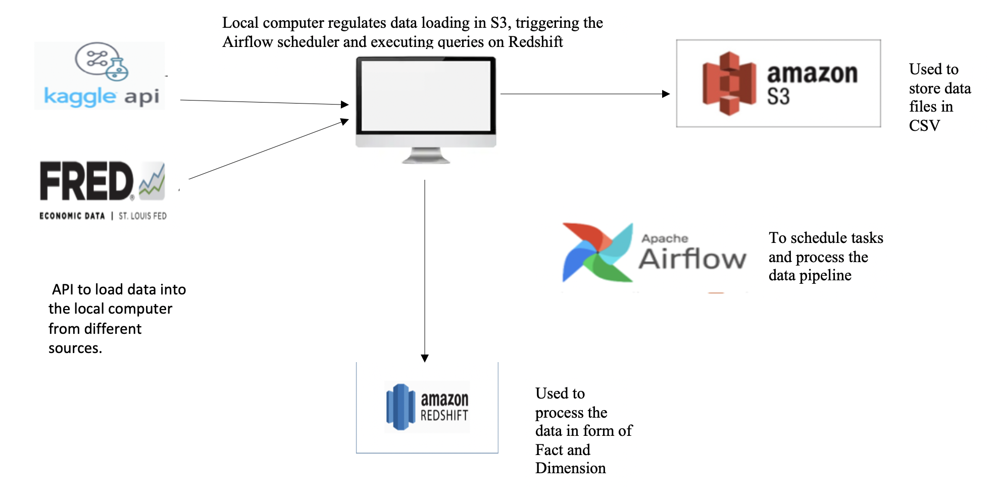
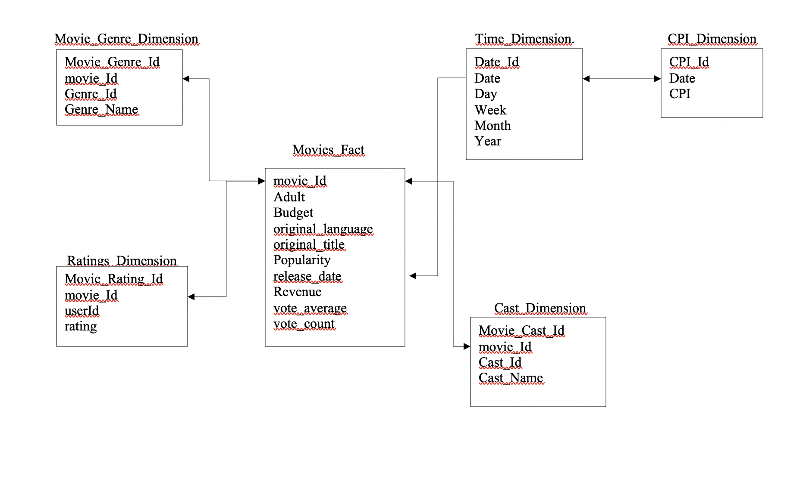
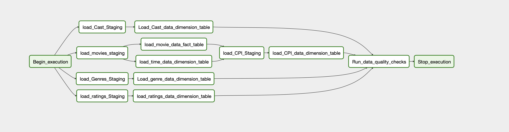

### Project Overview
---

The project deals with creating a recommendation engine of movies to the users.

The project involves performing ETL on data based on Movie_Metadata , Movie_genre , Movie_Casting and the CPI index for the time the movies were released.


Using the information derived from the dataset, the system would be able to answer typical question like  

    - Which are the top 5 movie genres based on the average rating of the movie?
    - Does casting particular people help increase the popularity of the movie?
    - Finding out if releasing the film at a particular time - in a particular month might affect the revenue?
    - Which are the top 5 genres based on the CPI index?


## Data sources
---
The system uses data from 2 different sources : -
1.	The movies , genre and cast data is based on the following Kaggle dataset.

    - (https://www.kaggle.com/rounakbanik/the-movies-dataset)

    There are multiple files containing the data for movies , genre and cast data.
    These files contain metadata for all 45,000 movies listed in the Full MovieLens Dataset. The dataset consists of movies released on or before July 2017. Data       points include cast, crew, plot keywords, budget, revenue, posters, release dates, languages, production companies, countries, TMDB vote counts and vote           averages.
    This dataset also has files containing 26 million ratings from 270,000 users for all 45,000 movies. Ratings are on a scale of 1-5 and have been obtained from       the official GroupLens website.


2.	The CPI (consumer Price Index) Data is collected from the below source.

    - (https://fred.stlouisfed.org/series/CUSR0000SS62031)


    This dataset contains Consumer Price Index for All Urban Consumers: Admission to Movies, Theaters, and Concerts in U.S. City Average


## Architecture 
---
a.	The above mentioned APIs are used to load data into the local system. This data is in form of a bunch of CSV files. Amongst those, the following are staged on     the S3 bucket 
    - credits.csv
    - movies_metadata.csv
    - ratings.csv 
    - CPI.csv
            
b.	Data is then staged from these files into the Staging tables in redshift using the COPY command. Further this staged data is converted into Dimension and Fact     tables on redshift itself. This is done using the Airflow scheduler where in each task is executed in a particular order. The Architecture  is as shown below.




## Schema
---
The Schema for the facts and  dimensions is as shown below. 




c.	For a staging the “Cast_staging “and the “Genre_staging” tables , some preprocessing is done on the data. This is cause the data is in form of a comma separated JSON structure. For eg, the genre column looks      like this 
    - '[{"id": 10749, "name": "Romance"}, {"id": 18, "name": "Drama"}, {"id": 9648, "name": "Mystery"}]'

    So to dump this into genre table,  ‘LoadGenreStagingOperator’ first ports in the Genre data from the S3 bucket.
    Then it filters on the Genre_id and Genre_name and stores it in a dataframe object. This is then converted into a csv object
    This csv object is further processed to enter the Genre_Data into the Staging table.

	The Cast data is processed by ‘LoadCastStagingOperator’  in similar way to form the Cast_Staging table. 


## Airflow Pipeline
---



    - The data-pipelining is done as follows. The data is ported from S3 into staging and then into Dimension/Fact tables. The tables are created earlier itself.
    - Further, we update the tables whenever new set of data is ported in based on the scheduler.
    - We also run the quality checks on fact and dimension tables after every cycle is complete.
    - Currently the DAG schedules the pipeline only once, but depending upon the requirement we can trigger it periodically everyday.


## Sample queries
---
1. Top 5 genres of movies based on a “avg_rating”
    
    select 
       movie_genre_dimension.genre_name,
       TRUNC( avg(ratings_dimension.rating) , 2)  as "avg_rating"
    from ratings_dimension
    inner join movies_fact on ratings_dimension.movie_id = movies_fact.movie_id
    inner join movie_genre_dimension on movies_fact.movie_id = movie_genre_dimension.movie_id
    group by  movie_genre_dimension.genre_name
    order by "avg_rating" Desc
    limit 5;


 2. The casting of the most popular films
   
    select 
        cast_dimension.cast_name,
        avg (movies_fact.popularity ) as "popularity"
    from movies_fact
    inner join cast_dimension on movies_fact.movie_id = cast_dimension.movie_id
    where movies_fact.popularity is NOT null
    group by cast_dimension.cast_name , popularity
    order by "popularity" DESC


   
  3. Finding out if releasing the film in a particular month might affect the revenue.

    select 
       sum(movies_fact.revenue) as "total_revenue",
       time_dimension.month
    from movies_fact  
    inner join time_dimension on movies_fact.release_date = time_dimension.date
    group by time_dimension.month 
    order by total_revenue desc
    
  


## Scalability and Related points
---
    What if data is increased by 100x?
       Currently the processing is done on local system. If we need faster processing, then we can employ much faster EC2 instances to handle the load.
       Also, we can use SPARK clusters if required to process this faster. Also, we can program the DAG to take only the subset of data at a time rather than in bulk.

    What if data pipeline needs to be run by 7am daily?
       We can trigeer the DAG to run at any time daily. Also, currently, the DAG runs of local system. If this was running on an EC2 instance, the DAG would itself run 
       at every regular interval without any disturbance.

    What if the database needs to be accessed by 100+ users?
       Redshift would be able to handle this load properly. Also, In order to optimize this further the tables can be redesigned / schema can be changed based on most common queries.
       Aggregated data tables can be provided beforehand to make queries more and more efficient.


## To set up and run the DAG with Docker Compose
---
These instructions will get you a copy of the project up and running on your local machine for development and testing purposes.

- Clone this repo
- Install the prerequisites
- Run the service
- Check http://localhost:8080

### Prerequisites

- Install [Docker](https://www.docker.com/)
- Install [Docker Compose](https://docs.docker.com/compose/install/)
- Following the Airflow release from [Python Package Index](https://pypi.python.org/pypi/apache-airflow)

### Usage

Run the web service with docker

```
docker-compose up -d

# Build the image
# docker-compose up -d --build
```

Check http://localhost:8080/

- `docker-compose logs` - Displays log output
- `docker-compose ps` - List containers
- `docker-compose down` - Stop containers


## Hooks in the Airflow
The project user 2 hooks in particular. The first one is the postgres hook.

To set it up , fist run the build using Docker Compose.
Then, Go to Admin -> Connections and create "redshift" postgress connection with following values.
- Conn Id: `redshift`.  
- Conn Type: `Postgres`.   
- Host: {redshift.xxxx.us-west-2.redshift.amazonaws.com:5439
- Schema: database name 
- Login: user id  
- Password: password  
- Port: `5439`

The second one is the 'AWS, hook to access the bucket data.
Go to Admin -> Connections and create "aws_credentials" AWS connection with following values.
- login - ['AWS_ACCESS_KEY_ID']
- password - ['AWS_SECRET_ACCESS_KEY']


## Credits

- Udacity for providing all the related contect.


